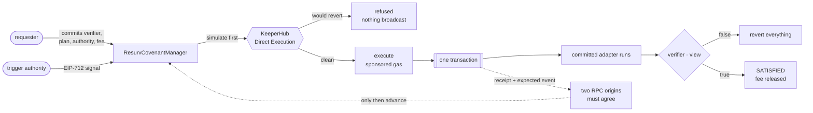
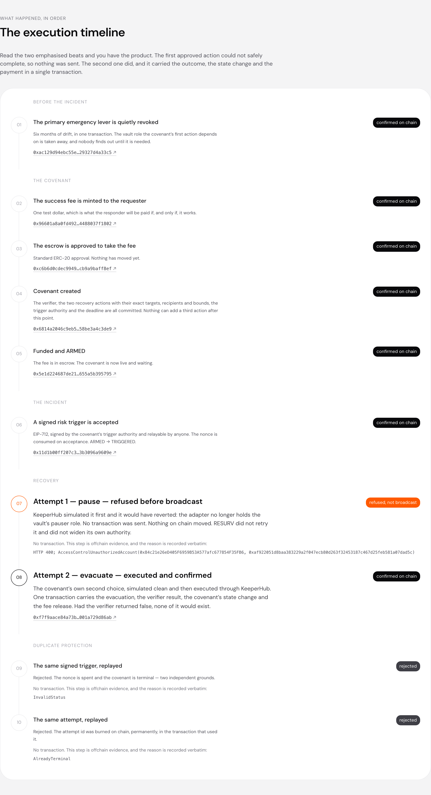
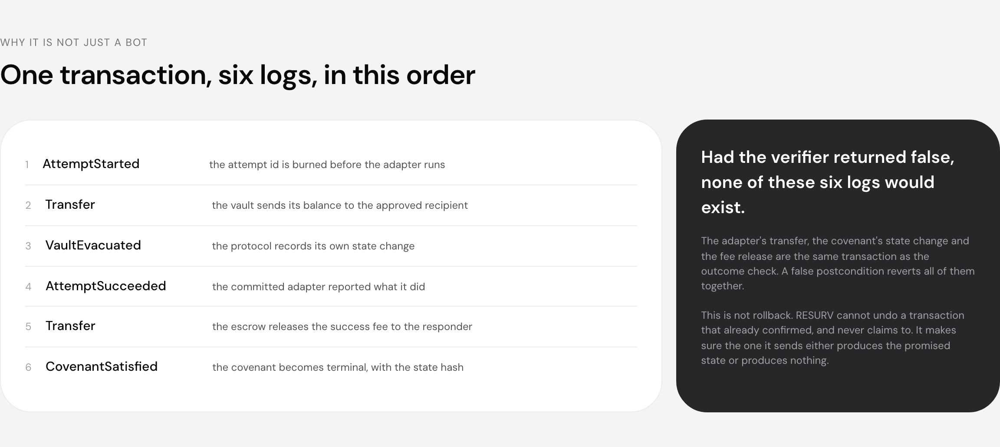

# RESURV

**Outcome-gated recovery execution for onchain agents.** RESURV keeps executing pre-authorized
recovery actions through KeeperHub until the promised onchain state is verified, then releases
payment.

[](https://github.com/winsznx/resurv/actions/workflows/ci.yml)
[](https://repo.sourcify.dev/84532/0x8e4c71d6c99a10f442e70fd236c3d583d9d9d284)
[](https://sepolia.basescan.org/address/0x8e4c71d6c99a10f442e70fd236c3d583d9d9d284)

| | |
|---|---|
| **Real KeeperHub transaction** | [`0xef63ee11…1f9c7e22`](https://sepolia.basescan.org/tx/0xef63ee114dea86da25f1d38802be8bfbdcce166a140f322d283f22a41f9c7e22) — the successful attempt, block 45421180 |
| **Public proof page** | `apps/web`. Serve it with `pnpm build && pnpm --filter @resurv/web preview`. The Cloudflare deploy is one command and a deliberate human step — see [Deployment](#13-deployment) |
| **Covenant** | `0xa5e71176ccfc47947d0a292bdd63fd0b8ccc64a2b62f1cfc9f1cbdb6787c9cf0` |
| **Covenant manager** | [`0x8e4c71d6…9d9d284`](https://sepolia.basescan.org/address/0x8e4c71d6c99a10f442e70fd236c3d583d9d9d284), deployed from commit `b9f8722`. Not Sourcify-verified — see [Contracts](#7-contracts) |
| **Tests** | 735 TypeScript, 122 Foundry. CI green on a clean runner, and in a clean-room clone of this repository |

Check the headline yourself in one command:

```bash
cast receipt 0xef63ee114dea86da25f1d38802be8bfbdcce166a140f322d283f22a41f9c7e22 \
  --rpc-url https://sepolia.base.org
```

Six logs, in this order: `AttemptStarted`, the vault's `Transfer` to the approved recipient,
`VaultEvacuated`, `AttemptSucceeded`, the escrow's `Transfer` to the responder,
`CovenantSatisfied`. The recovery action, the outcome check, the covenant's state transition and
the success fee are **one transaction**. Had the verifier returned false, none of those six logs
would exist.

---

## 1. The problem

Most onchain automation treats a confirmed transaction as success. A protocol operator does not
need a transaction. They need a state: the vault is empty and the approved Safe has the funds, the
protocol is paused, the dangerous approval is gone.

Those come apart in two directions, and both are ordinary rather than exotic.

- A transaction can confirm while the outcome stays false.
- The emergency action you planned for can have stopped working. A role revoked six months ago, a
  target upgraded, an assumption drifted. Nobody finds out until the incident, which is the worst
  possible moment to discover that step one of your runbook reverts.

## 2. The mechanism

A requester commits, before any incident, to four things that cannot change afterwards: a
deterministic **outcome verifier**, an ordered set of **approved recovery actions** with their
exact targets, recipients and bounds, one **trigger authority**, and an escrowed **success fee**.

When a signed risk trigger arrives, RESURV works down the list. Each attempt is one EVM
transaction that executes one committed action, evaluates the verifier, and **reverts the whole
thing if the outcome is still false**. When the outcome is true the covenant becomes terminal and
the fee transfers, in that same transaction.

The agent never gets to invent anything. It selects among adapters whose addresses and
configuration hashes were fixed before the covenant was armed. There is no path from a model's
output to a target, a selector, a recipient or an amount.



## 3. What the canonical demo does

<p align="center">
  
</p>

```text
before the incident   the vault role the primary action depends on is quietly revoked
the covenant          created and funded: verifier, two ordered actions, authority, deadline
the incident          a signed risk trigger is accepted, ARMED → TRIGGERED, nonce consumed
attempt 1  pause      SIMULATION REJECTED — the adapter lost the role. No transaction sent.
                      RESURV does not retry, does not widen its authority, does not guess.
attempt 2  evacuate   simulated clean, executed through KeeperHub, confirmed on two RPC origins
in that transaction   vault 0 · recipient 1.000000 rUSD · verifier true · covenant SATISFIED
                      · 1.000000 rUSD released to the responder
replay                the same trigger: rejected. The same attempt: rejected. Zero effects.
```

The refused primary action is the point. On chain, exactly one `AttemptSucceeded` and one
`CovenantSatisfied` have ever been emitted by that manager — check with `eth_getLogs` and you will
find no second economic effect.

## 4. Why KeeperHub is load-bearing

Not a wrapper. Three specific things, each of which changed the architecture.

1. **It is the execution path.** Simulation before broadcast is what refuses the primary action
   without spending gas or touching state. That refusal is the demo's turning point and it is a
   KeeperHub response. Every RESURV write — including the contract deployments — goes through the
   Direct Execution API.
2. **Gas sponsorship is what made the deployment possible at all.** The organization wallet holds
   zero native currency and there is no deployment endpoint, so the contracts were deployed by a
   sponsored contract call to a public CREATE2 factory. **RESURV deployed itself with no funded
   deployer and no faucet:** six contracts, six addresses predicted offchain before sending, six
   matches. [ADR-014](docs/DECISIONS.md).
3. **Its seam semantics dictated the state machine.** A day of measurement before any product code
   falsified the attempt lifecycle this project was about to build.

## 5. Measured KeeperHub semantics

Full report: [`PHASE_00_5_KEEPERHUB_ATTEMPT_SEMANTICS.md`](docs/phase-logs/PHASE_00_5_KEEPERHUB_ATTEMPT_SEMANTICS.md).
16 scenarios run live, evidence committed, 42 offline tests asserting the findings against that
evidence so a claim cannot drift away from its artifact.

The five that changed the design:

| Measured | Consequence |
|---|---|
| **HTTP 202 does not mean broadcast.** A refused attempt and a successful one both answer 202 with an `executionId` | There is no `ACCEPTED` state in RESURV. Read the body's `status`, then confirm on chain |
| **The POST is synchronous** | There is no `PENDING` state and no polling on the happy path |
| **A new idempotency key repeats the economic action** | Transport idempotency is not semantic idempotency. The onchain attempt id is what makes it permanent |
| **A lost response is genuinely ambiguous and genuinely resolvable** | `RECONCILIATION_REQUIRED` is a state, not an error, and nothing leaves it on a timer |
| **`safe_inner_failure` exists** | An outer receipt of `0x1` is not proof. Confirmation requires the expected event |

One sentence carries all of it:

> **An HTTP status never advances a covenant. A chain read does.**

## 6. Architecture

```text
apps/web              the public proof page (React 19, Vite, tokens from design.md)
apps/worker           one Cloudflare Worker: /api/* plus the SPA as static assets
packages/contracts    Foundry. Manager, two capability adapters, verifier, demo protocol
packages/domain       reference models: covenant state machine + measured attempt lifecycle
packages/keeperhub-client  typed transport. Parses and records; decides nothing
packages/orchestrator the attempt lifecycle executed: durable claim → send → reconcile
packages/chain        two-origin RPC quorum, receipt projection, CreateX constants
packages/proof        the committed evidence, typed. Imported by the page and the Worker
packages/cli          live:contracts, live:demo, screenshots
packages/repo-policy  executable repository policy. Tests only; ships nothing
packages/config       environment validation and secret redaction
packages/node-runtime host-process concerns: the repository root, the credential loader
packages/db           Drizzle schema. A design artifact; nothing imports it at runtime
packages/seam-probe   the Phase 0.5 measurement harness
```

**There is no database.** The orchestrator persists to an `fsync`'d append-only journal, which is
what the durability argument actually requires: the idempotency key and canonical body on stable
storage before the first POST. Nothing to provision, no connection string, no credential.
[ADR-016](docs/DECISIONS.md).

## 7. Contracts

Five of the six are verified on **Sourcify at `match` level** — creation *and* runtime bytecode reproduce
exactly from this repository at the pinned compiler settings — and propagated to Blockscout.

| Contract | Address | Verified source |
|---|---|---|
| `ResurvCovenantManager` | [`0x8e4c71d6…`](https://sepolia.basescan.org/address/0x8e4c71d6c99a10f442e70fd236c3d583d9d9d284) | **not verified** — `no_match`, three attempts |
| `PauseAction` | [`0x2bf292c9…`](https://sepolia.basescan.org/address/0x2bf292c9bceac8a2d0846a05b8b49917977c98e2) | [Sourcify](https://repo.sourcify.dev/84532/0x2bf292c9bceac8a2d0846a05b8b49917977c98e2) |
| `EvacuateERC20Action` | [`0x196f0125…`](https://sepolia.basescan.org/address/0x196f0125e73a78438f1518e5eb46d9f03afd2197) | [Sourcify](https://repo.sourcify.dev/84532/0x196f0125e73a78438f1518e5eb46d9f03afd2197) |
| `VaultSafeStateVerifier` | [`0xd71f1709…`](https://sepolia.basescan.org/address/0xd71f170915bf9204033b40746ee3c5f05de712f1) | [Sourcify](https://repo.sourcify.dev/84532/0xd71f170915bf9204033b40746ee3c5f05de712f1) |
| `DemoVault` | [`0x291efc6f…`](https://sepolia.basescan.org/address/0x291efc6f53559d8316761309e856772f10d0cdc4) | [Sourcify](https://repo.sourcify.dev/84532/0x291efc6f53559d8316761309e856772f10d0cdc4) |
| `TestUSD` | [`0x42a48b75…`](https://sepolia.basescan.org/address/0x42a48b758d36866ee18b117f101aafdbb49bc7c7) | [Sourcify](https://repo.sourcify.dev/84532/0x42a48b758d36866ee18b117f101aafdbb49bc7c7) |

```bash
curl -s https://sourcify.dev/server/v2/contract/84532/0x8e4c71d6c99a10f442e70fd236c3d583d9d9d284 \
  | jq '{match, creationMatch, runtimeMatch}'
```

Two qualifiers, both load-bearing. `ResurvCovenantManager` is **not** verified: three Sourcify
submissions answered `no_match`, the other five verify from the same build, and the cause is
unresolved. And Basescan may still list all of them as unverified, because Sourcify's forwarding
to Etherscan hit a daily submission limit. Nothing here claims Basescan verification.
`docs/DEPLOYMENTS.md` gives the `cast code` check that works without Sourcify.

## 8. The state machines

Two, both judged against independent reference models transcribed from the specification that
never call the implementation ([ADR-009](docs/DECISIONS.md)).

**Onchain covenant** (PRD 9.1), enforced by `ResurvCovenantManager`:

```text
NONE → DRAFT → ARMED → TRIGGERED → EXECUTING → SATISFIED
                 │         │           └──────→ EXPIRED
                 │         └──────────────────→ EXPIRED
                 └──────────────────────────→ CANCELLED
```

**Offchain attempt lifecycle**, measured in Phase 0.5, specified by [ADR-013](docs/DECISIONS.md):

```text
PLANNED ─► REJECTED_LOCALLY | SIMULATION_REJECTED | SIMULATED_OK
SIMULATED_OK ─► KEY_COMMITTED
KEY_COMMITTED ─► EXECUTED_NO_EFFECT | RECONCILIATION_REQUIRED
RECONCILIATION_REQUIRED ─► CONFIRMED | REVERTED | PROVEN_NOT_BROADCAST | itself
```

From `KEY_COMMITTED` or `RECONCILIATION_REQUIRED`, RESURV may only replay the **same** idempotency
key with a byte-identical body. It may not rotate the key, may not try a different action, and may
not advance on elapsed time.

## 9. Live proof

- **Receipt**: [`docs/proof/canonical-covenant.json`](docs/proof/canonical-covenant.json)
- **Manifest**: [`deployments/base-sepolia.json`](deployments/base-sepolia.json)
- **Page**: `pnpm build && pnpm --filter @resurv/web preview`
- **JSON**: `GET /api/proof`, `GET /api/proof/summary`, `GET /api/deployment`

`/api/proof/summary` is the endpoint an independent verifier is meant to disagree with: nine
booleans, each reproducible with one `cast` command.

<p align="center">
  
</p>

## 10. Security model

Full version in [`docs/THREAT_MODEL.md`](docs/THREAT_MODEL.md).

- **A false outcome reported as success.** The verifier is `view`, reached by STATICCALL inside the
  attempt, and a false result reverts everything. A verifier that tries to write reverts.
- **Paying twice.** Terminal states are absorbing, escrow settles once per covenant behind an
  explicit flag, and the onchain attempt id is burned permanently.
- **A duplicate economic effect from a retried request.** KeeperHub bounds effects per *key*; a new
  key for the same action was measured executing it a second time. The onchain attempt id is what
  actually stops that.
- **An agent inventing calldata.** Adapters are capabilities with committed addresses and config
  hashes. There is no raw-calldata path anywhere.
- **A single node deciding a proof.** Every terminal chain state requires two independent origins
  to agree on the material projection of the receipt.

## 11. Testing

| Suite | Count | What it holds up |
|---|---|---|
| Foundry unit and fuzz | 109 | Every covenant path, both adapters, the verifier, adversarial fixtures, audit regressions |
| Foundry invariants | 13 | Fee moves once, terminal blocks attempts, escrow conserved, admin cannot rewrite an armed covenant, every transition legal |
| `@resurv/repo-policy` | 412 | Permission boundary, tracked secrets, auto-approved script graph |
| `@resurv/seam-probe` | 71 | Phase 0.5 measurements, asserted against committed evidence |
| `@resurv/domain` | 63 | Both state machines against reference models, exhaustively |
| `@resurv/orchestrator` | 32 | Crash resume, concurrent workers, lost response, RPC disagreement, inner failure, bounded polling that converges |
| everything else | 157 | Config redaction, chain constants, proof artifacts, Worker routes, the page, the timeline under adversarial receipts |

Property tests are judged against reference models that never call the implementation.

The suite was checked by **mutation**, three times, and the third campaign is the one worth
reading. It found that a regression test named after a fund-loss guard passed with that guard
deleted, against the entire suite including a 256-run fee invariant, because every public path
into it is stopped one layer earlier. It found an off-by-one in the reconciliation loop that
failed nothing, because no test had ever asserted a round count. Both are now caught, and every
test added since was checked by reverting its fix and confirming exactly that test fails.

Four in-repo reviewers — contracts, KeeperHub, tests, claims — ran against the finished build.
**Three returned FAIL.** The contracts round found three more ways to trap a covenant's escrow
permanently, each with a working proof, including two shapes of the same defect a previous round
had claimed to close. All three are fixed in source and pinned by
[`AuditRegressions.t.sol`](packages/contracts/test/AuditRegressions.t.sol). Two findings are
accepted rather than fixed and named. These are agents in this repository, **not a third-party
security audit**. The full account, including what the deployed contracts do and do not contain:
[`PHASE_07_FINAL_AUDIT.md`](docs/phase-logs/PHASE_07_FINAL_AUDIT.md).

## 12. Clean-room reproduction

```bash
git clone --recurse-submodules https://github.com/winsznx/resurv && cd resurv
pnpm install --frozen-lockfile
pnpm gate
```

Node 24+, pnpm 11+, Foundry. Exact pins in [`docs/VERSIONS.md`](docs/VERSIONS.md). No credential is
needed: nothing in the gate makes a network call. Every path is repo-relative.

Reproducing the **live** half needs a KeeperHub organization key beginning `kh_` in a repository
root `.env`, and lands real Base Sepolia transactions. See [`docs/RUNBOOKS.md`](docs/RUNBOOKS.md).

## 13. Deployment

Contracts and the live covenant, both of which spend the organization credential:

```bash
pnpm --filter @resurv/cli live:contracts --dry-run   # predicts every address, sends nothing
pnpm --filter @resurv/cli live:contracts             # deploys through CreateX
pnpm --filter @resurv/cli live:demo --dry-run        # simulates every step, broadcasts nothing
pnpm --filter @resurv/cli live:demo                  # runs a new canonical covenant
```

Both resume rather than repeat: every write is journalled with its idempotency key before it is
sent. Neither is reachable from an auto-approved Claude Code command.

The web application deploys to Cloudflare and nowhere else:

```bash
pnpm build
pnpm --filter @resurv/worker deploy
```

`wrangler deploy` is in this repository's own Claude Code deny list, in every wrapper form, and
`packages/repo-policy` has tests that fail if anyone allow-lists a path to it. That control backs a
`VERIFIED` row in the claim ledger, so the deploy stays a deliberate human step rather than
something an agent talks itself into.

## 14. Known limitations

- **Testnet.** Base Sepolia. No mainnet deployment and no external audit, so nothing here is
  production-ready by this project's own definition.
- **A verifier that runs out of gas at any budget still has no exit**, and nothing validates a
  verifier or an adapter at covenant creation. Same root cause, named and not fixed: the remedy is
  a conformance probe that needs its own design and its own review.
- **Trusted parties.** The KeeperHub organization wallet and the RESURV admin are trusted. In the
  demo the requester, the admin and the executor are the same address; in production they are three
  parties.
- **A reverted broadcast was never observed.** Two routes were tried and both failed, because
  KeeperHub refuses to broadcast a call whose gas estimation reverts. `REVERTED` is implemented and
  tested anyway. Nothing is claimed about how it presents.
- **`safe_inner_failure` is documented and never observed**, handled conservatively.
- **A covenant already satisfied at trigger time can still pay a full fee** if an executor runs an
  action against it. Faithful to the PRD's own `executeAttempt`; the PRD is what is wrong. Accepted
  for v1 and recorded.
- **The planner is deterministic.** Action order is the covenant's committed order. The
  model-assisted ranking in PRD 13 is not built, which removes a component from the demo and
  nothing from the safety argument: no model was ever in the safety path.
- **The concurrency test cannot interleave**, because the in-memory store's `reserve` is
  synchronous. The design is right; that specific test asserts something it cannot observe.

## 15. Repository structure

```text
apps/             web (proof page), worker (Cloudflare)
packages/         contracts, domain, keeperhub-client, orchestrator, chain, proof,
                  cli, db, config, node-runtime, repo-policy, seam-probe
deployments/      the deployment manifest, written by the deployment itself
docs/             claims, decisions, threat model, runbooks, proof ladder, phase logs
docs/proof/       the canonical outcome receipt
docs/assets/      screenshots, captured from the production bundle
docs/bounty/      the KeeperHub onboarding-bounty artifact
docs/phase-logs/  what each phase did, what it refuted, what it could not measure
```

Start with [`docs/FINAL_BUILD_REPORT.md`](docs/FINAL_BUILD_REPORT.md) — it ends with the seven
things I think are weakest, in the order I would attack them.

## Claim discipline

[`docs/CLAIMS.md`](docs/CLAIMS.md) is the ledger and no public surface may exceed it. RESURV does
not claim, anywhere: trustlessness, multi-transaction rollback, MEV protection or private routing,
exactly-once execution from KeeperHub idempotency alone, atomic x402 coupling, an external audit,
or production readiness.

## License

MIT. See [LICENSE](LICENSE).
